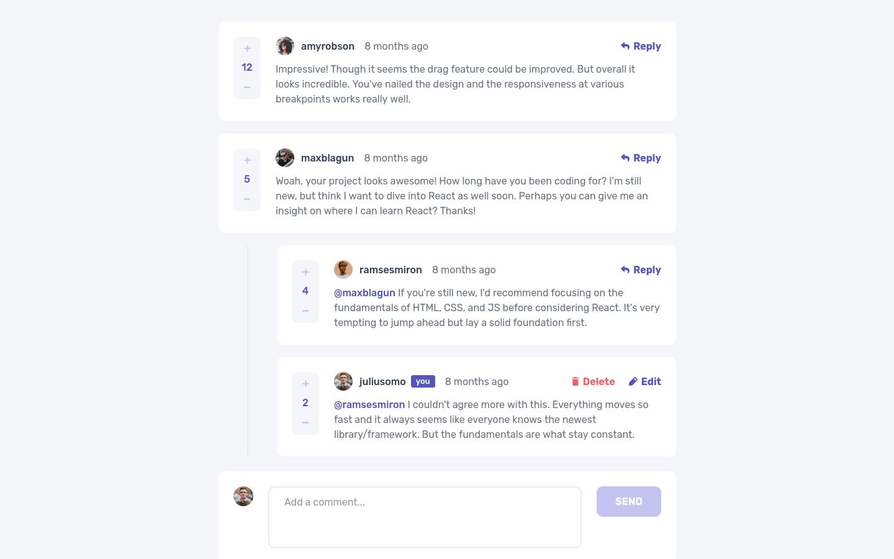

# 🗨️ Interactive comments section



## 📄 Descrição

Este projeto é uma solução para o desafio Interactive Comments Section do site Frontend Mentor. O desafio consistia em construir uma seção de comentários com recursos interativos.

Link da projeto: https://interactive-comments-section-eta.vercel.app/

## 🛠 Tecnologias Utilizadas

-   [React](https://react.dev/)
-   [TypeScript](https://www.typescriptlang.org/)
-   [Styled Components](https://styled-components.com/)
-   [Eslint](https://eslint.org/)
-   [Prettier](https://prettier.io/)
-   [EditorConfig](https://editorconfig.org/)
-   [Context API](https://pt-br.legacy.reactjs.org/docs/context.html)
-   [Vite](https://vitejs.dev/)

## ✨ Funcionalidades

-   [x] Criar, editar e deletar comentários e respostas
-   [x] Dar likes em comentários
-   [x] Dados persistem

## 📋 Pré-requisitos

Antes de começar, você vai precisar ter instalado em sua máquina as seguintes ferramentas: [Git](https://git-scm.com/), [Node.js](https://nodejs.org/en).

Além disto é bom ter um editor para trabalhar com o código como [VSCode](https://code.visualstudio.com/).

## 🚀 Como Executar

```bash
# Clone este repositório
$ git clone https://github.com/grazziotti/interactive-comments-section

# Acesse a pasta do projeto no terminal/cmd
$ cd interactive-comments-section

# Instale as dependências
$ npm install

# Execute o projeto
$ npm run dev

```

## 👤 Autor


[Daniel Grazziotti](https://github.com/grazziotti)
